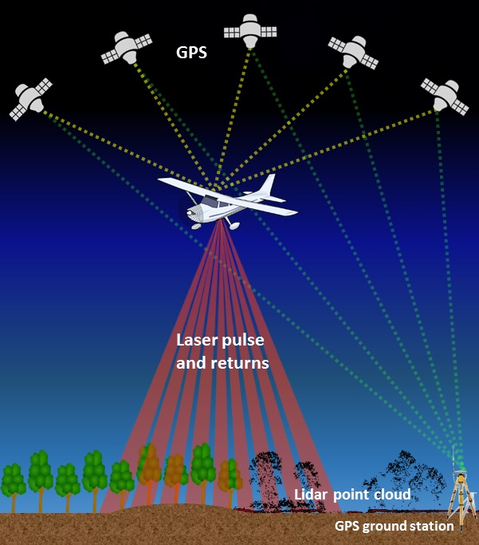
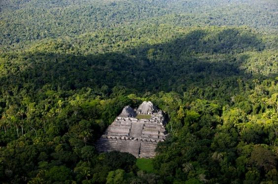
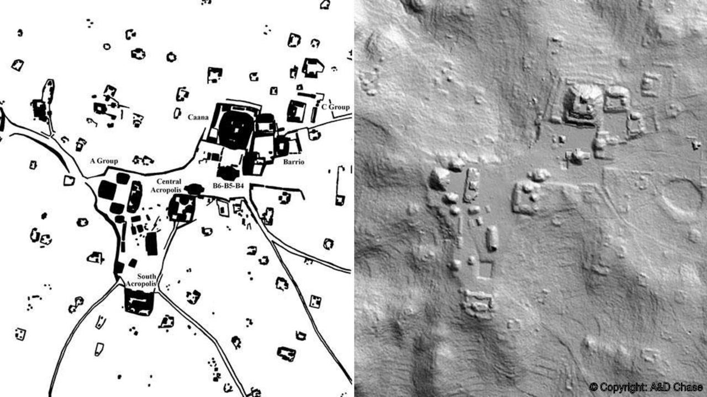

```{r setup, include=FALSE}
knitr::opts_chunk$set(echo = TRUE)
```

##Preliminaries
Load and install the following packages: {tmap}, {leaflet}, {rgdal}, {rgeos}, {sp}, {raster}, {adehabitatHR}, {devtools}, {rayshader}, {mapmate}

##Objectives
The objective of this module is to demonstrate some of the capabilities R has for handling spatial data. We will provide you with a brief overview of the various formats of spatial data, explain how to import spatial data into R, and provide a few examples of spatial data manipulation.  


##Preliminaries
Load and install the following packages: {sf}, {raster}, {tmap}

#Shapefile
Shapefile is a data storage format where you can store different types of geographic information and geospatial data such as location, shape, line and points and their various details such as names etc. The information in a shapefile is actually a big set of files with large data in them combined within one shapefile. Like a csv file shapefile (shp file for short) also has different set of details and files where large data is stored that can be seen in columns when loaded to R. Many GIS applications and softwares such as ArcGIS use shp file for their visualizations, mapping and analyses. But since they are not usually free it’s a great feature that R has as a free tool.

#point data, Raster data
Point data represent distinct and separate points and are commonly defined by their geographic coordination and can be located within a polygon, for example location of a bridge and an archaeological site can be shown as a point.

Raster data or “gridded” data represents surfaces and are saved as pixels where each pixel represents a surface.  

So now that we know the definition of the above terms we know that I mentioned them because they are among the most important features in geospatial visualization.

##Objectives


##Loading GIS Data into R

##Point Pattern Analysis

##Density Mapping

```{R}
library(tmap)
library(leaflet)
library(rgdal)
library(rgeos)
library(sp)
library(raster)
library(adehabitatHR)
```
```{R}
#Using a one line code you can load shapefile into R and read it: m <- readOGR(".", "Zipped_SPA_Shape_file") 
#The other format of code you can use for this purpose is m1 <- readOGR("shp/Zipped_SPA_Shape_file.shp",layer="Zipped_SPA_Shape_file"), but i found this format a little problematic and confusing, and it also gives erros if you dont use it carefully, so i recomment the first code
#The “.” Is the source and the "Zipped_SPA_Shape_file" is the layer which is the name of the file without the suffixes. 
#read the shapefile using the bellow code
#Download data from https://github.com/ajlocker/ADA-SpatialAnalysis/blob/master/Zipped_SPA_Shape_file.shp

mydata1 <-readOGR(".", "Zipped_SPA_Shape_file")
mydata1
head(mydata1)
```
```{R}
#Plot the data into a map
plot(mydata1)
```
```{R}
# Creates a choropleth map of our any( in this case SQ_MILES) variable
#With a choropleth map you can show statistical data with different specifications such as color and symbols shading on the map
m <- qtm(mydata1, fill = "SQ_MILES")
m
```
```{R}
#Removes the black borders
tm_shape(mydata1) + tm_fill("SQ_MILES")
```
```{R}
#Add borders
#Alpha is the transparency of the borders 
tm_shape(mydata1) + tm_fill("SQ_MILES") + tm_borders(alpha=.9)
```
```{R}
#Adding a north arrow
tm_shape(mydata1) + tm_fill("SQ_MILES") + tm_compass()
```
```{R}
#Giving a title to the map
tm_shape(mydata1) + tm_fill("SQ_MILES", palette = "Reds",
style = "quantile", title = "% with a SQ_MILES") +
tm_borders(alpha=.4) +
tm_compass() +
tm_layout(title = "Camden, Arizona", legend.text.size = 1.1,
legend.title.size = 1.4, legend.position = c("right", "top"), frame = FALSE)
```
## ## Mapping densities

Density mapping is a means of visualizing concentrations of spatial phenomena. Point data are most often used for density mapping, but lines can also be used. If you have a high volume of point data distributed across a large area, it may be difficult to understand the distribution of points. Density maps can simplify this data by showing where points are concentrated.

Density mapping can be incredibly useful when you have a large data set representing isolated phenomena over a continuous surface (e.g., artifacts, populations). As such, density mapping would not be useful for representing small data sets, or data that represents continuous phenomena (e.g., elevation or temperature). With spatial data visualization it is important to understand first what kind of data you have, and what you want to represent or analyze.

```{R}
#Download data from https://github.com/ajlocker/ADA-SpatialAnalysis/blob/master/DEPARTAMENTO.shp

#Loading and plotting shapefile (Peru and its departamentos)
DEPARTAMENTO <- readOGR(".", "DEPARTAMENTO")
# Setting the coordinate system
proj4string(DEPARTAMENTO) <- CRS("+init=EPSG:32718")
plot(DEPARTAMENTO)
```
```{R}
#Download data from https://github.com/ajlocker/ADA-SpatialAnalysis/blob/master/SitioArqueologico.shp

#Loading and plotting point data (recorded archaeological sites in Peru)
SitioArqueologico <- readOGR(".", "SitioArqueologico")
# Setting the coordinate system
proj4string(SitioArqueologico) <- CRS("+init=EPSG:32718")
plot(SitioArqueologico)
```

Here we see that we have a very high density of points and it is difficult to distinguish where the higher concentrations of points are located at this resolution.

## Kernel density

```{R}
#Kernel density estimation uses a moving quadrant to calculate the density for each area within a given threshold.
kde.output <- kernelUD(SitioArqueologico, h="href", grid = 1000)
plot(kde.output)
```
```{R}
#Convert to raster
kde <- raster(kde.output)
```
```{R}
#Map raster
tm_shape(kde) + tm_raster("ud")
```
```{R}
# Mask the raster by the output area polygon.
masked_kde <- mask(kde, SitioArqueologico)
# Catchment boundaries for kernel density estimates.
range75 <- getverticeshr(kde.output, percent = 75)
range50 <- getverticeshr(kde.output, percent = 50)
range25 <- getverticeshr(kde.output, percent = 25)
```
```{R}
tm_shape(DEPARTAMENTO) + tm_fill(col = "#f0f0f0") + tm_borders(alpha=.8, col = "white") + tm_shape(SitioArqueologico) + tm_dots(col = "blue") +
tm_shape(range75) + tm_borders(alpha=.7, col = "#fb6a4a", lwd = 2) + tm_fill(alpha=.1, col = "#fb6a4a") +
tm_shape(range50) + tm_borders(alpha=.7, col = "#de2d26", lwd = 2) +
tm_fill(alpha=.1, col = "#de2d26") +
tm_shape(range25) + tm_borders(alpha=.7, col = "#a50f15", lwd = 2) +
tm_fill(alpha=.1, col = "#a50f15") + tm_layout(frame = FALSE)
```

##Overlaying Maps and Creating 3D Maps

##3D Plotting to Visualize Data

#Load in the packages

#LiDAR Data and R

**Li**ght **D**etection **A**nd **R**anging **(LiDAR)** is very useful survey method that uses pulses of laser light to measure reflected distance between a given sensor (typically on the bottom of an airplane) and a survey area. 



This becomes exceptionally useful when your research area is in the middle of a neo-tropical jungle. 3D images and maps can be created based on the differences in response time, where objects that are higher in elevation are returned more quickly than objects lower in elevation.  



You can see that the forest canopy is fairly dense around the site. LiDAR essentially allows us to complete an aerial survey and remove the canopy layer to see what is happening below the tree line.  



##Using LiDAR data to create Digital Elevation Models in R

The first thing we will need to do is set up a working directory for the files.

```{r}
# Load needed packages
library(raster)

# set working directory to data folder
# setwd("C:/Users/ajlocker/Desktop/R Geospatial")
```

You'll need to go to download the following files and save them inside your working directory.

https://github.com/ajlocker/ADA-SpatialAnalysis/blob/master/ATXLiDAR/demTIN.tif

https://github.com/ajlocker/ADA-SpatialAnalysis/blob/master/ATXLiDAR/hsTIN.tif

https://github.com/ajlocker/ADA-SpatialAnalysis/blob/master/ATXLiDAR/demlocal.tif


Next, we are going to load in the data by assigning them to be rasters. The DEM file is a Digital Elevation Model, which tells R elevation values from the scanned LiDAR data. The hs file is a Hillslope image.  

```{r}
# assign raster to object
dem <- raster("C:/Users/ajlocker/Desktop/R Geospatial/ATX/demTIN.tif")

# view info about the raster.
dem
```

Plot the Digital Elevation Model
```{r}
plot(dem, main="Digital Elevation Model \n Austin, Texas")
```


So here, we can see basic elevation differences from the surveyed area, but it doesn't show us much detail from the LiDAR imaging. We can examine this data much more effectively by plotting it on top of the Hillshade file, which will essentially add depth to the map. 

```{r}
hs <- raster("C:/Users/ajlocker/Desktop/R Geospatial/ATX/hsTIN.tif")

# view info about the raster.
hs
```

```{r}
# plot hillshade file
plot(hs,
        col=grey(1:100/100),  # creates a gray scale coloring for the hillshade data
        legend=FALSE,         # removes any legend
        main="LiDAR Survey Austin, Tx", #sets the title of the image
        axes=FALSE)          # removes any axes titles to keep the image looking clean

#then plot the DEM ontop of the hillshade
plot(dem, 
        axes=FALSE,
        alpha=0.5,   # transparency of the object (0=transparent, 1=not transparent)
        add=T)  # add=TRUE (or T); this will add the chm plot on top of the plot we coded immediately above
```

#Creating an Interactive Map

We're going to use the {leaflet} package to plot our lidar data onto an existing map. We can then zoom in and out to see where our data are geographically. 


```{r}
library(leaflet)
hs <- raster("C:/Users/ajlocker/Desktop/R Geospatial/ATX/hsTIN.tif")
pal <- colorNumeric(c("#0C2C84", "#41B6C4", "#FFFFCC"), values(hs),
  na.color = "transparent")

leaflet() %>% addTiles() %>%
  addRasterImage(hs, colors = pal, opacity = 0.8) %>%
  addLegend(pal = pal, values = values(hs),
    title = "Elevation")
```
`
#Creating 3D Maps
There is a great package called Rayshader, where you can mainpulate raster images in some really cool ways. 

```{r}
# To install the latest version from Github:
library(devtools)
devtools::install_github("tylermorganwall/rayshader")
```

We're going to use a raster file of just elevation points to generate this map. 

```{r}
library(rayshader)

#First pull in the data. 
demlocal <- raster::raster("C:/Users/ajlocker/Desktop/R Geospatial/ATX/demtin.tif") 

#Next, we need convert our raster to a matrix:
atxmat = matrix(raster::extract(demlocal,raster::extent(demlocal),buffer=1000),
               nrow=ncol(demlocal),ncol=nrow(demlocal))

#Then we are going to plot with a slight shadow
atxmat %>%
  sphere_shade(texture = "bw") %>%
  add_shadow(ray_shade(atxmat,lambert = TRUE), 0.7) %>%
    plot_map()
```

```{r}
#adds ambient shading to the map
ambmat = ambient_shade(atxmat)

#This will generate a 3D interactive map. It should generate a pop-up window
atxmat %>%
  sphere_shade(texture = "bw") %>%
  add_water(detect_water(atxmat), color="bw") %>%
  add_shadow(ray_shade(atxmat,zscale=3,maxsearch = 300),0.5) %>%
  add_shadow(ambmat,0.5) %>%
  plot_3d(atxmat,zscale=10,fov=0,theta=135,zoom=0.75,phi=45, windowsize = c(1000,800))
render_snapshot()
```

You could then take this 3D generated plot and print it on a 3D printer using the command save_3dprint("atx.stl")


##Concept Review
Spatial Data has sevaral formats and each of them can be read in R. 

R has the ability to read and manipulate LiDAR data. 

You have the ability to generate interative and 3D maps/models with packages like {leaflet} and {rayshader}.  